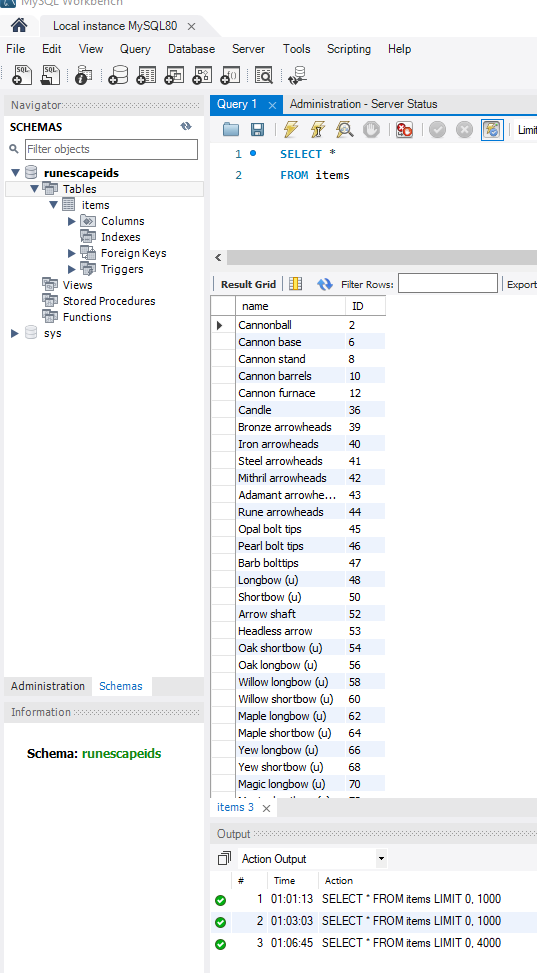

# OSRS_Bond
**Webscrapping Old School Runescape for Item: Bond, to know when to sell/buy**
- Checks bond price every hour to see if it has increased enough to sell at margin goal.
- **Note:** OSRS_Bond.exe only works if included python modules are installed(requests,beautifulsoup,win10toast,etc,etc)
- **Note:** GUI implementation does not correlate with the python script as of yet(Working on them seperately)
## To Do:
- [x] Notify for minimum buy price
- [ ] Expand ability to work for other items (Retrace database for new/expired items)
- [x] Implement GUI for input by user (Currently finished outline)
- [ ] Clean up code for price stripping situation
- [x] Begin scrapping item names and item prices
- [x] Store Items in SQL Database

## Updates:
```bash
- Added Minimum buy price Notify.
- Added Image snippets
- Added Base GUI
- Added User Input
- Implemented new script to scrap data and store into .txt file
- Stored all items and associated IDs into a SQL database
``` 

## Image Snippets:

 
 



